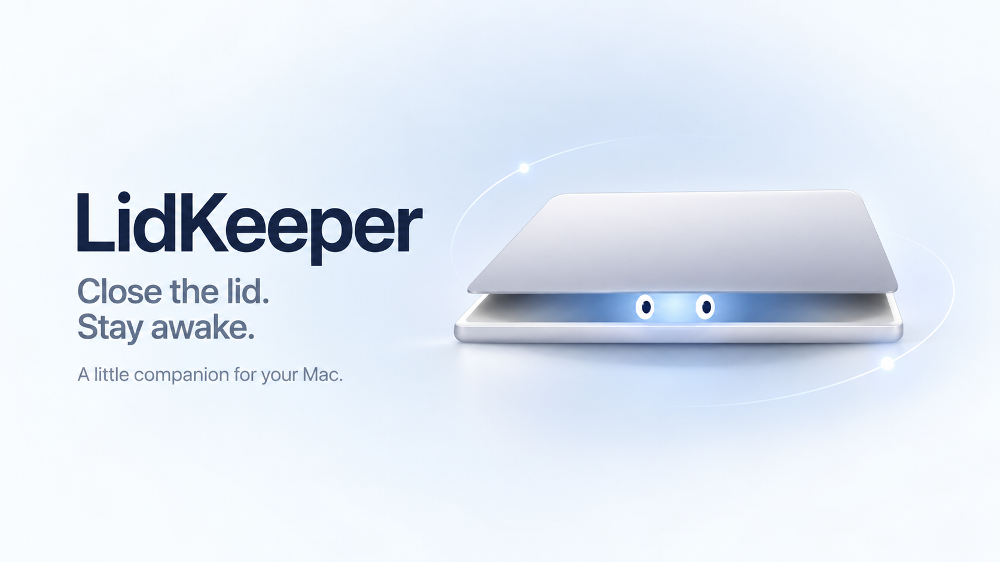

# LidKeeper



**Close the lid. Stay awake.**

[▶ 觀看 15 秒介紹影片（英文旁白與字幕）](https://github.com/kjohh/lidkeeper/blob/main/exports/lidkeeper-intro.mp4) · [下載 MP4](https://raw.githubusercontent.com/kjohh/lidkeeper/main/exports/lidkeeper-intro.mp4)

選單列上的一個開關：讓 MacBook 闔上螢幕之後不要睡。

macOS 沒有提供這個開關。系統設定「電池」裡那個「在使用電源轉接器時，避免在顯示器關閉時自動進入睡眠」只管閒置睡眠，管不到闔蓋；闔蓋是另一條路徑，除非接了外接螢幕（clamshell 模式），否則插著電也一樣會睡。唯一能擋的是 `pmset disablesleep`，而它要 root 權限，所以沒有圖形介面可以按。

這個 app 就是那顆按鈕。

## 長怎樣

選單列上一個圖示，兩種狀態：

| 圖示 | 意思 |
|---|---|
| ☕️ 咖啡杯（實心） | 闔蓋不會睡 |
| 🌙 月亮 | 闔蓋會睡（系統預設） |

點開來可以切換、可以設定開機自動啟動、可以結束。就這些。

打開 app 之後會從圖示滑出一個小提示告訴你它在哪，幾秒後自己消失。

在咖啡杯狀態下按結束時，會先問你要留下哪個狀態，因為這個設定寫在系統上，app 關掉之後還是會生效，而那時選單列上已經沒有開關可以改了。

## 裝起來

```bash
cd ~/work-station/lidkeeper
./build.sh
open LidKeeper.app
```

第一次按下「闔蓋保持清醒」時，會跳出系統的密碼對話框。輸一次之後就不會再問了：那一次會在 `/etc/sudoers.d/lidkeeper` 放一條規則，讓你的帳號可以免密碼跑 `pmset -a disablesleep 0` 和 `1` 這兩條指令，其他 `pmset` 參數一律不受影響。

不想等 app 問，也可以先在**終端機**（Terminal.app，不是 Claude Code 的 `!`，那裡沒辦法輸密碼）裡手動裝：

```bash
sudo ./Scripts/install-sudoers.sh
```

想從選單列以外的地方確認現在的狀態：

```bash
ioreg -r -c IOPMrootDomain -d 1 | grep SleepDisabled
```

## 換一台電腦

不需要任何 Apple 開發者帳號或憑證。把這個 repo pull 下來，在那台上重跑一次上面三行就好。

圖示是 `AppIcon.icns`，已經在 repo 裡，不用另外產生。

重點是**在那台自己編**，不要把編好的 `.app` 傳過去。從網路或 AirDrop 傳進去的 app 會被加上 quarantine 標記，Gatekeeper 會擋；本機自己編出來的沒有那個標記，直接就能跑。

那台需要有 Xcode Command Line Tools（`xcode-select --install`），不用裝完整的 Xcode。

## 移除

```bash
sudo rm /etc/sudoers.d/lidkeeper
sudo pmset -a disablesleep 0
```

然後把 app 結束、資料夾刪掉。

## 為什麼不用 Amphetamine

Amphetamine（App Store 免費）功能一樣而且更多，會是正常人的選擇。這個 app 存在的理由是它只做一件事、程式碼三百行不到、想改什麼直接改。
